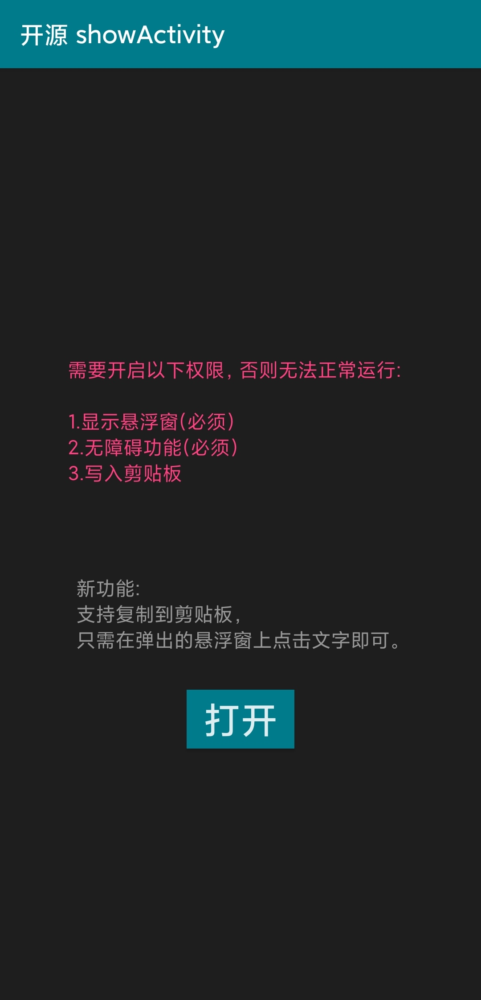
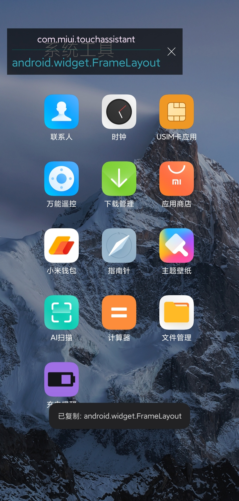
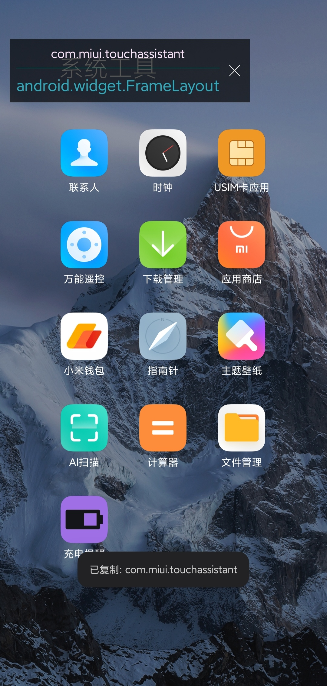

## 新增功能:
可复制到剪贴板。现在可以把检测到的activity复制到剪贴板了，保护视力👀从现在开始 ！ 

# 
# 

# 新版图片

## 主界面 + 悬浮窗1 + 悬浮窗2

  

# 
# 
# 

# 写在前面
- 接手陌生模块时，如何快速了解每个页面对应的类，以及它们之间的跳转逻辑。总不能在代码里一个一个地找`startActivity()`吧？

- 有时候，又想查看别人的 app 的页面组织（像淘宝、微信啊），总不能一个一个反编译吧？

总想着有没有工具查看当前的`Activity`，于是自己弄了一个，这下就方便了。
 

# 效果图
先看下淘宝好了：
我好像看到了`com.taobao.weex.XXX`，难道`weex`已经在用了？

再来看掘金：
我好像看到了`com.daimajia.XXX`，`代码家`乱入了，这背后有什么PY交易？

最后看一个 bilibili：
可以看到用了`support`包里的`DrawerLayout`把~

 

# CSDN链接
http://blog.csdn.net/a153614131/article/details/53891190
 

# APK 下载体验
[ActivityTracker.apk](https://github.com/fashare2015/ActivityTracker/blob/master/apk/app-release.apk?raw=true)
 

# 使用
- 6.0 以上版本需要`悬浮窗权限`。所以打开`app`时，会进入权限管理页面。勾选`悬浮窗权限`才能正常使用。

- 之后，返回`app`，点击`开启悬浮窗`按钮。此时需要你开启辅助功能（无障碍功能）。注意：一些`国产ROM`此功能可能在更深层的`无障碍`页面（如魅族、小米等）。

- 返回`app`，点击`开启悬浮窗`按钮，即可使用。

 

# 参考
[轻松自制flyme悬浮球](https://halfstackdeveloper.github.io/2016/11/27/%E8%BD%BB%E6%9D%BE%E8%87%AA%E5%88%B6flyme%E6%82%AC%E6%B5%AE%E7%90%83/)

[通过 Android 辅助功能「Accessibility Service」 检测任意前台界面](http://effmx.com/articles/tong-guo-android-fu-zhu-gong-neng-accessibility-service-jian-ce-ren-yi-qian-tai-jie-mian/)

